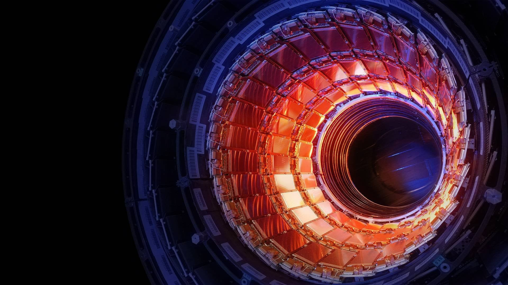

# CMS Visit material

Collection of educational and informative material about the Compact Muon Solenoid detector at CERN. Reference information for introducing visitors to the experiment, how it was built, how it is operating, how it is being upgraded, etc..

  

For guides:
- [An overview of the CMS experiment](https://cds.cern.ch/record/2629323/files/CMSdocumentforGuides.pdf)
- [Introduction to CMS (Slides)](https://indico.cern.ch/event/23313/attachments/388446/540226/CMSfor_CERNguides.pdf)

Introduction to particle accelerators:

- [How to Design a Particle Accelerator - with Suzie Sheehy](https://www.youtube.com/watch?v=V_hirIK9eFs)
- [Particle Accelerators Reimagined - with Suzie Sheehy](https://www.youtube.com/watch?v=jLmciZdh5j4)

Introduction to CMS:

- [Inside the Large Hadron Collider (CMS) - Sixty Symbols](https://www.youtube.com/watch?v=5r6vyZ2bykg)
- [Tour of CMS](https://www.youtube.com/watch?v=S99d9BQmGB0)

Posters:
- [Facts about CMS](https://cms-docdb.cern.ch/cgi-bin/PublicDocDB/RetrieveFile?docid=4030&version=4&filename=CMSFactsheet_EN_Sept2013.pdf)
- [Subdetectors and physics](http://cds.cern.ch/record/2200142/files/SetOfPosters_EN_20112014_web.pdf?version=1)

Articles:

- Building CMS
    - [Massive Underground Excavation](https://cms.cern/detector/massive-underground-excavation)
    - [Civil Engineering](https://cms.cern/index.php/detector/civil-engineering)

Additional references:

- [Recordings of CMS Virtual Visits](https://indico.cern.ch/category/5975/)
- [CMS website](https://cms.cern)

All material is (c) CERN, CMS Collaboration
